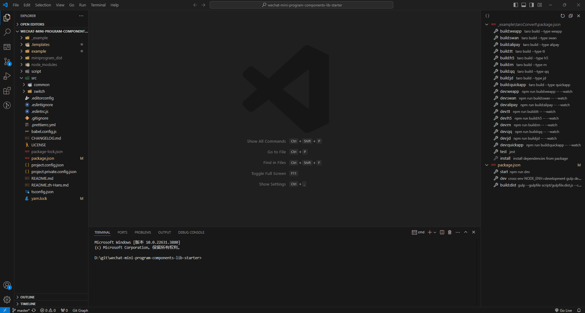
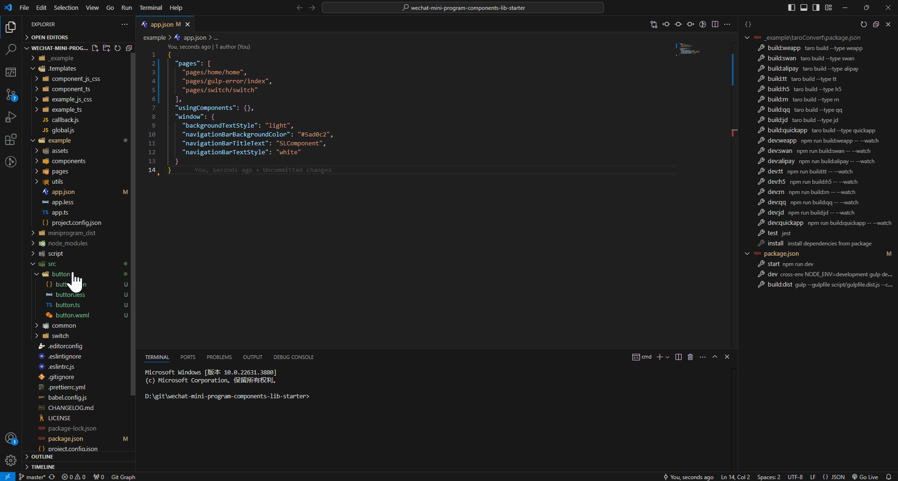

<h1 align="center">New From Nunjucks Template</h1>

<p align="center">
  <a style="text-decoration:none" href="https://github.com/shilim-developer/new-from-nunjucks-template/blob/master">
    
  </a>
  <a style="text-decoration:none" href="https://github.com/shilim-developer/new-from-nunjucks-template/blob/master/LICENSE">
    
  </a>
  <a style="text-decoration:none" href='https://coveralls.io/github/shilim-developer/new-from-nunjucks-template?branch=master'></a>
</p>

<div align="center">
<strong>
<samp>

English | [简体中文](README.zh-Hans.md)

</samp>
</strong>
</div>

## Marketplace
[Visual Studio Marketplace](https://marketplace.visualstudio.com/items?itemName=shilim.npm-scripts-auto-node)

## Introductions

Creates a new file/folder structure from nunjucks template

## Features

- Generate files through nunjucks templates
- Support global parameters and local parameters
- Support creating callbacks before and after

## Template Preparation
### Template Directory Structure

```
.templates                          
├─ template_file         (Template Name) [Single File Template]
│  └─ @@config.js        (Template Replacement Parameter List Configuration File)
│  └─ @@params.js        (Template Replacement Parameter Object) [optional]
│  └─ file_name.js       (Template File)               
├─ template_folder       (Template Name) [Folder Template]
│  └─ @@config.js        (Template Parameter List Configuration File)
│  └─ component_name     (Template Folder)    
│     └─ file_name.css     
│     └─ file_name.html 
│     └─ file_name.js 
├─ callback.js           (Callback)    
└─ global.js             (Global Parameter)
```
### @@config.js

```javascript
exports.fileParams = ["file_name"];
exports.templateParams = [];
```
### @@params.js
```javascript
module.exports = () => {
  return {
    fileParams:{
      file_name: 'helloworld',
    },
    templateParams:{
      content: 'hello',
    }
  };
};
```
### @@callback.js
```javascript
exports.newFolder = (path, params) => {
  console.log(path,params);
};

exports.newFile = (path) => {
  console.log(path);
};

exports.finish = () => {
  console.log("finish");
};
```
### Template Language 
use  [nunjucks](https://github.com/mozilla/nunjucks)

## Usage

### Example of Creating WeChat Mini Program Code with Templates


### Example of Creating WeChat Mini Program Code with Templates and Auto registry app.json

## ChangeLog

[ChangeLog](./CHANGELOG.md)

## License

[License MIT](./LICENSE)