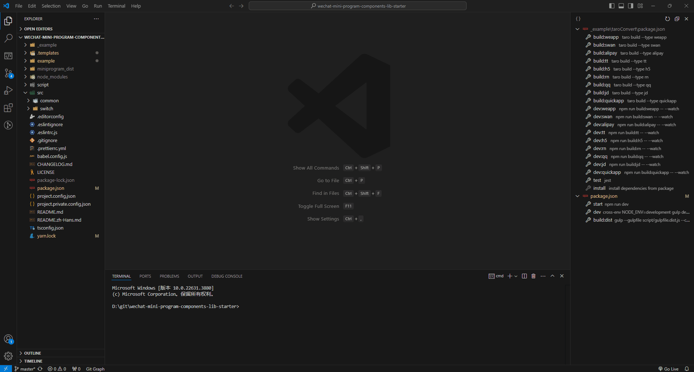
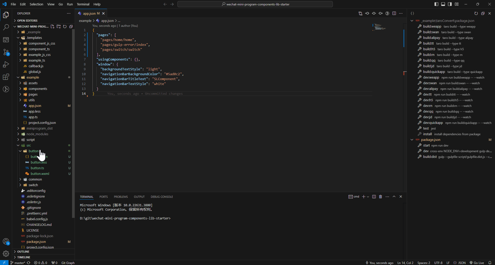

<h1 align="center">New From Nunjucks Template</h1>

<p align="center">
  <a style="text-decoration:none" href="https://github.com/shilim-developer/new-from-nunjucks-template/blob/master">
    
  </a>
  <a style="text-decoration:none" href="https://github.com/shilim-developer/new-from-nunjucks-template/blob/master/LICENSE">
    
  </a>
  <a style="text-decoration:none" href='https://coveralls.io/github/shilim-developer/new-from-nunjucks-template?branch=master'></a>
</p>

<div align="center">
<strong>
<samp>

[English](README.md) | 简体中文

</samp>
</strong>
</div>

## 内容目录

<details>
  <summary>点我 打开/关闭 目录列表</summary>

- [插件市场](#插件市场)
- [介绍](#介绍)
- [功能介绍](#功能介绍)
- [模板准备](#模板准备)
- [开始使用](#开始使用)
- [推荐](#推荐)
- [更新日志](#更新日志)
- [开源协议](#开源协议)

</details>

## 插件市场
[Visual Studio Marketplace](https://marketplace.visualstudio.com/items?itemName=shilim.new-from-nunjucks-template)

## 介绍

一个通过nunjucks模板来创建文件的vscode插件

## 功能介绍

- 通过nunjucks模板来创建文件
- 支持全局参数和局部参数
- 支持创建文件后的回调

## 模板准备
### 模板目录结构

```
.templates                          
├─ template_file         (模板名称) [单文件模板]
│  └─ @@config.js        (模板可替换参数列表配置文件)
│  └─ @@params.js        (模板替换参数对象) [可选]
│  └─ file_name.js       (模板文件)               
├─ template_folder       (模板名称) [文件夹模板]
│  └─ @@config.js        (模板可替换参数列表配置文件)
│  └─ component_name     (模板文件夹)    
│     └─ file_name.css     
│     └─ file_name.html 
│     └─ file_name.js 
├─ callback.js           (回调函数)    
└─ global.js             (全局参数文件)
```
### @@config.js

```javascript
exports.fileParams = ["file_name"];
exports.templateParams = [];
```
### @@params.js
```javascript
module.exports = () => {
  return {
    fileParams:{
      file_name: 'helloworld',
    },
    templateParams:{
      content: 'hello',
    }
  };
};
```
### 模板文件
使用  [nunjucks](https://github.com/mozilla/nunjucks)

## 开始使用


### 创建小程序模板案例


### 创建小程序模板并自动注册app.json案例


## 推荐

- [template-new-cli](https://github.com/shilim-developer/template-new-cli) 一个通过nunjucks模板来创建文件的cli工具
- [snippets-viewer
](https://github.com/shilim-developer/snippets-viewer) 一个vscode的代码段查看器

## 更新日志

[ChangeLog](./CHANGELOG.md)

## 开源协议

[License MIT](./LICENSE)